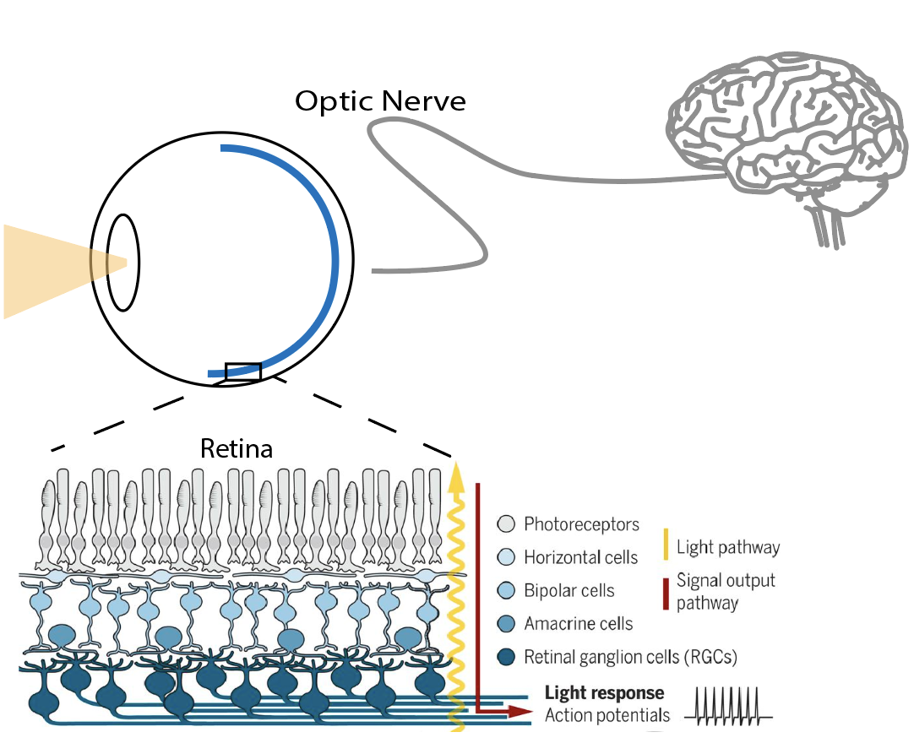

```{r setup, include=FALSE}
knitr::opts_chunk$set(echo = FALSE, warning=F, message=F)
```

```{r, include = F}
library(tidyverse)
library(vtree)
library(flextable)
library(magick)
library(ggpubr)
```


```{r source-code, include = F}
#code from other sources

#found this code on stackoverflow: https://stackoverflow.com/questions/54100806/r-markdown-how-do-i-make-text-float-around-figures
defOut <- knitr::knit_hooks$get("plot")  # save the default plot hook 
knitr::knit_hooks$set(plot = function(x, options) {  # set new plot hook ...
  x <- defOut(x, options)  # first apply the default hook
  if(!is.null(options$wrapfigure)) {  # then, if option wrapfigure is given ...
    # create the new opening string for the wrapfigure environment ...
    wf <- sprintf("\\begin{wrapfigure}{%s}{%g\\textwidth}", options$wrapfigure[[1]], options$wrapfigure[[2]])
    x  <- gsub("\\begin{figure}", wf, x, fixed = T)  # and replace the default one with it.
    x  <- gsub("{figure}", "{wrapfigure}", x, fixed = T)  # also replace the environment ending
  }
  return(x)
})

 #code from: https://stackoverflow.com/questions/57175351/flextable-autofit-in-a-rmarkdown-to-word-doc-causes-table-to-go-outside-page-mar

 FitFlextableToPage <- function(ft, pgwidth = 6){

  ft_out <- ft %>% autofit()

  ft_out <- width(ft_out, width = dim(ft_out)$widths*pgwidth /(flextable_dim(ft_out)$widths))
  return(ft_out)
 }

 #idep functions: http://bioinformatics.sdstate.edu/idep/
  source('iDEP_core_functions.R') 
```


  A large effort in neuroscience is the assessment and treatment of degenerative diseases. The underlying question can be stated as follows: what are the structural and functional changes during degeneration and how can they be corrected? An example of a neurodegenerative disease is retinitis pigmentosa (RP), a form of incurable blindness that initially targets the rod photoreceptor cells. In this disease, loss of rods initiates alterations to the overall retinal circuitry [@Fariss2000; @Fei2002; @Strettoi2000]. One potential impact is cone-mediated vision, which is responsible for daylight vision and acuity. Another potential impact is the synaptic connections between cones and their downstream bipolar cells. Understanding how retinitis pigmentosa alters the genetic profiles of bipolar cells may provide insights on how cone vision is affected by disease and improve genetic treatments for retinitis pigmentosa. 

```{r my-fig,echo=FALSE,out.width = ".6\\textwidth", fig.align="right", wrapfigure = list("R", .6), fig.cap="Diagram of Visual Transduction Process at the Retina: Physical light first travels through the retina. Light gets transformed into biological signals and gets transmitted from photoreceptors to bipolar cells and finally to retinal ganglion cells. These signals then travels to the brain where the remainder of vision occurs." , fig.align= 'center'}

```

  Though the retina's structure and function is stable after development, photoreceptor degeneration has been shown to remodel the retina and possibly deteriorate retinal function [@Lund1998; @Pu2006; @Puthussery2009; @Sauve2001]. In prior studies of the retina, the retina has been observed to have abnormal contacts with bipolar cells and disruptive spontaneous activity near the ganglion cells during RP (see Fig 1A for location) [@Pfeiffer2020; @Puthussery2009]. However, recent studies suggest that the retina is able to compensate functionally to this disease [@Care2020]. For example, bipolar cells have been shown to be able to form new contacts with different photoreceptor cells and functionally compensate for rod loss (Care et al., 2019; Johnson et al., 2017; Shen et al., 2020)). In terms of treatments, in a slow rod degeneration model, prevention of rod loss has been shown to maintain the synaptic connections of photoreceptor cells (Koch et al., 2012; Michalakis et al., 2014; and Petersen-Jones et al., 2018). These adaptations from RP and from treatment indicate that useful vision may return to normal if rod loss is halted. It is likely that the time-dependent mechanisms following treatment and degeneration lead to retinal adaptations and also contribute to whether changes are deleterious or favorable for vision outcomes. Thus, evaluating treatment options will require measuring the adaptations across various stages of degeneration and various treatment time courses.   
  
  Overall, the mechanisms of adaptations in retina's bipolar cell synapses with cones during degeneration and after treatment are unknown. In this analysis, we sought to determine whether the retina compensates for the photoreceptor degeneration and contributes to useful vision. We utilized a mouse model for retinitis pigmentosa caused by a CNGB1 mutation in the rod photoreceptors, a true cause of inherited blindness. This model can also simulate a treatment through a cre-lox recombination that prevents further degeneration progression. By conducting RNA-sequencing of bipolar cells in diseased, control, and treated mice, we find _____ (description of results). These results provide confidence in therapies for maintaining cone vision and potential target genes in therapies for retinitis pigmentosa and photoreceptor degeneration diseases. 

## Data Collection

We use the CNGB1 mouse (ages 30-210 days) to model RP. In these mice, a neoloxP cassette has been inserted into intron 19 of the Cngb1 gene (cyclic nucleotide gated channel, beta-1 subunit). This cassette prevents the expression Cngb1, a critical component of phototransduction whose dysfunction leads to rod death [@Biel2007;@Huttl2005]. Mutations in this gene cause RP in humans, giving us the ability to model a genuine cause of blindness [@Bareil2001]. 

The CNGB1 genetically rescued mice undergoing RP. The neoloxP cassette that induces RP can be removed through cre-mediated recombination. To obtain temporal control of Cre-mediated rod rescue, we have crossed these mice with CAG-CreER mice. Offspring mice (henceforth, called Cngb1neo/neo), when fed tamoxifen, express Cre in rod photoreceptors, which removes the neoloxP cassette and induces normal Cngb1 expression. Thus, tamoxifen administration halts rod death in this disease, mimicking gene therapy. This system allows us to monitor changes in bipolar cell gene expression as a function of rod photoreceptor death and following a treatment that stops RP progression. Data was collected at the Field Lab at Duke Neurobiology. A diagram of the samples in this study are listed below: 

```{r tree,fig.heigh = 4, fig.width = 8}
sample_counts <- read_csv("rp-samples.csv") %>%
  select(1:4)

sample_counts <- sample_counts %>%
  mutate(Treatment = case_when(
    `Treatment Date` == 30 ~ "Treatment at 30 Days",
    `Treatment Date` == 90 ~ "Treatment at 90 Days",
    TRUE ~ "No Treatment"))


```


In an initial principle components analysis, we find that there are differences between treated, diseased, and control biological samples. This dimension reductionality device allows assessment of the similarity and between samples and across the three groups. The two principle components in Fig 3 explain a majority of the variance across the gene expression samples. Control and treated samples show high similarity with respect to the first principal components and a small within group variance. The diseased group has one biological replicate that is dissimilar from the 3 other samples in its group. Overall, this sample group separation shares that genetic differences exist in the bipolar cells of treated, diseased, and controlled retinas. 

```{r, include = FALSE, pre-process-data}
 # Input files 
 # Expression file has to use Ensembl for gene ID. Otherwise, use custom pathway database with matching IDs. 
 inputFile <- 'eda_data.csv'  # Expression matrix
 # Experiment design file
 sampleInfoFile <- 'cng_design_file.csv'  
  #Gene symbols, location etc. 
 geneInfoFile <- 'Mouse__mmusculus_gene_ensembl_GeneInfo.csv' 
 # pathway database in SQL; can be GMT format 
 geneSetFile <- 'Mouse__mmusculus_gene_ensembl.db'   
 STRING10_speciesFile <- 'https://raw.githubusercontent.com/iDEP-SDSU/idep/master/shinyapps/idep/STRING10_species.csv' 

 # Parameters
 input_missingValue <- 'geneMedian'	#Missing values imputation method
 input_dataFileFormat <- 1	#1- read counts, 2 FKPM/RPKM or DNA microarray
 input_minCounts <- 0.5	#Min counts
 input_NminSamples <- 1	#Minimum number of samples 
 input_countsLogStart <- 4	#Pseudo count for log CPM
 input_CountsTransform <- 3	#Methods for data transformation of counts. 1-EdgeR's logCPM; 2-VST; 3-rlog 

 #Read data files
 readData.out <- readData(inputFile) 
 readSampleInfo.out <- readSampleInfo(sampleInfoFile) 
 input_selectOrg ="NEW" 
 input_selectGO <- NULL 	#Gene set category 
 input_noIDConversion = TRUE  
 allGeneInfo.out <- geneInfo(geneInfoFile) 
 converted.out = NULL 
 convertedData.out <- convertedData()	 
 nGenesFilter()  
 convertedCounts.out <- convertedCounts()  # converted counts, just for compatibility 
 readCountsBias()  # detecting bias in sequencing depth 
```


```{r, include = FALSE}
 input_selectFactors <- 'genotype'	#Factor coded by color
 #PCA plots
 

library(ggpubr)
pca_fig <-  PCAplot()	+ theme_pubr() + labs(color = "Genotype", 
                                            title = "Groups well separated across PCA") + 
   scale_color_brewer(palette = "Dark2",
                      labels = c("CNG w/ 30 Day Treatment",
                                 "CNG",
                                 "Control")) +
  theme(legend.position = "bottom")
 dev.off()
```

```{r,fig.cap="Principal Components Analysis of P30 Treated, P210 Diseased, and P210 Control Animals", out.width = ".7\\textwidth", fig.align="center"}
pca_fig
```


```{r, include=FALSE}
##########################
# 4. k-Means clustering 
##########################
 input_nGenesKNN <- 2000	#Number of genes fro k-Means
 input_nClusters <- 4	#Number of clusters 
 maxGeneClustering = 12000
 input_kmeansNormalization <- 'geneMean'	#Normalization
 input_KmeansReRun <- 0	#Random seed 

  distributionSD()  #Distribution of standard deviations 
  KmeansNclusters()  #Number of clusters 
  Kmeans.out = Kmeans()   #Running K-means 


 
  # png(filename = "heatmap.png", width = 800, height = 800, pointsize = 20)
  # KmeansHeatmap()   #Heatmap for k-Means
  # dev.off()
```


```{r, fig.cap="K-Means Clustering of Genes across P30 Treated, P210 Diseased, and P210 Control Samples"}
kmeans <- image_read('heatmap.png')
 ggplot()+
  background_image(kmeans) + coord_fixed()
```


By running an unsupervised k-means clustering across all samples, gene clusters indicated that expression differences were involved in nervous system pathways. In this analysis, genes were ranked with greatest differences by their standard deviations and only the top 2000 genes were clustered. Clustered gene sets were then analyzed for which biological pathways they were concentrated in and most were found to be involved in nervous system development and processes (see Appendix for Full Information). This analysis indicates that changes in bipolar cells from disease and treatment across sample groups are associated with nervous system development. 

Given there are genetic differences observed in animals with RP and those that are treated, it would be useful to study exactly what genes become affected and how they contribute to the biological processes and mechanisms of blindness. From a preliminary analysis of these genes, it is likely these genes are involved in visual system. A more involved analysis involving the effect of treatment time and disease progression should better reveal the mechanisms of disease and treatment.      

# Appendix

```{r}
 #Read gene sets for enrichment analysis 
 sqlite  <- dbDriver('SQLite')
 input_selectGO3 <- 'GOBP'	#Gene set category
 input_minSetSize <- 15	#Min gene set size
 input_maxSetSize <- 2000	#Max gene set size 
 GeneSets.out <-readGeneSets( geneSetFile,
    convertedData.out, input_selectGO3,input_selectOrg,
    c(input_minSetSize, input_maxSetSize)  )  
 # Alternatively, users can use their own GMT files by
 #GeneSets.out <- readGMTRobust('somefile.GMT')  
 results <- KmeansGO()  #Enrichment analysis for k-Means clusters

 results %>% 
   mutate_if(is.numeric, ~sprintf("%.3f",.)) %>%
   flextable::flextable() %>%
   autofit()
```


