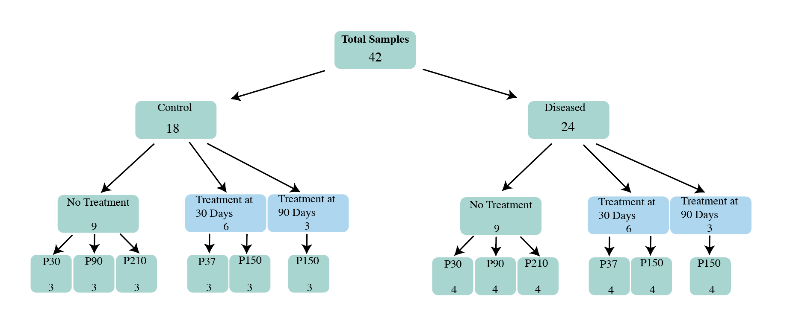

# Introduction

```{r include=FALSE}

#found this code on stackoverflow: https://stackoverflow.com/questions/54100806/r-markdown-how-do-i-make-text-float-around-figures
defOut <- knitr::knit_hooks$get("plot")  # save the default plot hook 
knitr::knit_hooks$set(plot = function(x, options) {  # set new plot hook ...
  x <- defOut(x, options)  # first apply the default hook
  if(!is.null(options$wrapfigure)) {  # then, if option wrapfigure is given ...
    # create the new opening string for the wrapfigure environment ...
    wf <- sprintf("\\begin{wrapfigure}{%s}{%g\\textwidth}", options$wrapfigure[[1]], options$wrapfigure[[2]])
    x  <- gsub("\\begin{figure}", wf, x, fixed = T)  # and replace the default one with it.
    x  <- gsub("{figure}", "{wrapfigure}", x, fixed = T)  # also replace the environment ending
  }
  return(x)
})
```


A large effort in neuroscience is the assessment and treatment of degenerative diseases. The underlying question can be stated as follows: what are the structural and functional changes during degeneration and how can they be corrected? An example of a neurodegenerative disease is retinitis pigmentosa (RP), a form of incurable blindness that initially targets the rod photoreceptor cells. This disease affects nearly 2 million people worldwide and often leads to near-complete blindness in patients. The debilitating disease is currently incurable, but there are many research efforts to improve vision outcomes in patients at the lab.

```{r my-fig,echo=FALSE,out.width = ".6\\textwidth", fig.align="right", wrapfigure = list("R", .6), fig.cap="Diagram of Visual Transduction Process at the Retina: Physical light first travels through the retina. Light gets transformed into biological signals and gets transmitted from photoreceptors to bipolar cells and finally to retinal ganglion cells. These signals then travels to the brain where the remainder of vision occurs." , fig.align= 'center'}
knitr::include_graphics("intro-fig.png")
```

In this disease, the loss of rods initiates alterations to the overall retinal circuitry [@Fariss2000; @Fei2002; @Strettoi2000]. One potential impact is cone-mediated vision, which is responsible for daylight vision and acuity. Another potential impact is the synaptic connections between cones and their downstream bipolar cells (see Figure 1 for diagram of retina layers). This part of the retina has not been genetically assayed using large-scale genomic sequencing before, nor to study this disease. Thus, analysis of the genetic profiles of bipolar cells may provide insights on the mechanisms in which vision is altered by RP and improve the efficacy of genetic treatments. 

Overall, the adaptations in the retina's bipolar cell synapses with their photoreceptor partners following treatment are unknown. In this analysis, we sought to determine whether the retina exhibits genetic mechanisms during genetic rescue. We utilized a mouse model for retinitis pigmentosa caused by a CNGB1 mutation in the rod photoreceptors, a genuine cause of inherited blindness in humans. This model also simulated a treatment (also referred to as "rescue" here) through a cre-lox recombination that prevents further degeneration progression. By analyzing RNA-sequencing data from bipolar cells, we found that RGS5 and \textit{GRIN2b} were associated with rescue.  These results provide potential target genes in bipolar cells therapies for retinitis pigmentosa and photoreceptor degeneration diseases. 

# Data and Exploratory Data Analysis

We use the CNGB1-KO mouse (ages 30-210 days) to model RP. In these mice, a neoloxP cassette has been inserted into intron 19 of the Cngb1 gene (cyclic nucleotide gated channel, beta-1 subunit). This cassette prevents the expression Cngb1, a critical component of phototransduction whose dysfunction leads to rod death [@Biel2007;@Huttl2005]. Mutations in this gene delivers a slow progression of RP, giving us the ability to monitor bipolar cell gene expression as a function of rod photoreceptor death [@Bareil2001]. 

The CNGB1 mice can be genetically rescued mice to halt RP. The model's neoloxP cassette that induces RP can be removed through cre-mediated recombination. To obtain temporal control of Cre-mediated rod rescue, we have crossed these mice with CAG-CreER mice. Offspring mice (henceforth, called Cngb1neo/neo), when fed tamoxifen, express Cre in rod photoreceptors, which removes the neoloxP cassette and induces normal Cngb1 expression. Thus, tamoxifen administration halts rod death in this disease, mimicking gene therapy. This system allows us to monitor changes in gene expression following a rescue that stops RP progression. Data was collected at the Field Lab at Duke Neurobiology from the courtesy of Miranda Scalabrino, PhD. A diagram of the samples collected and overall experiment design is available in Figure 2. 



By running an unsupervised k-means clustering across a subset of samples from, gene clusters indicated that expression differences were involved in nervous system pathways. Here, genes were ranked by those that had the largest standard deviations in gene expression and the top 2000 genes were selected for clustering (Figure 3B). After clustering of the genes sets, we found a large subset of those genes were involved in nervous system development and processes (see Appendix for table of biological processes). This analysis indicates that changes in bipolar cells in these 9 samples are associated with nervous system development.			


With a principal components analysis of gene expression levels, we find that there is variability between a subset of the treated, diseased, and control biological samples (Figure 3B). The dimension reductionality in PCA provides a general assessment of the similarity between samples and across the three groups. The two principal components in Figure 3A explain a majority (53%) of the variance across its 9 samples. Control and treated samples have high similarity with respect to the first principal components and have small within group variances. The diseased group has one biological replicate that is dissimilar from the 3 other samples in its group. Overall, this observation motivated us to uncover the exact changes in expression in treated and diseased mice. A subset of those genes may lead to knowledge about the mechanisms of how this disease progresses during rescue. 		

Given there are genetic differences observed in animals with RP and those that are treated, it would be useful to study how they contribute to the biological processes and mechanisms of blindness. From a preliminary analysis of these genes, it is possible these genes are responsible for disease and rescue. However, a more involved analysis including statistical modeling may better reveal the mechanisms of disease and treatment.

# Methodology


## Genetic Two-Group Comparison

We used a negative binomial model to find genetic targets for treatment of RP. To do so, we analyze gene expression changes between the diseased (Age of 30 Days) and treated groups (Treated 30/Aged to 37 Days). In doing so, we first normalized raw counts across samples by using the transcript per million or TPM method, which normalizes by gene length first and then by the sequencing depth (quantity of reads per sample). Next, we measured dispersion for each gene using maximum likelihood estimation. These gene-specific dispersion values were shrunk to the expected dispersion value using DESeq's empirical bayes method. We utilized DESEQ2 functions in R to fit this model to each gene (@deseq2):

\begin{equation}
\begin{aligned}
K_{ij}  &\sim NB(\mu_{ij}, \alpha_{i}) \\
\mu_{ij} &= s_{j}q_{ij} \\
log_2(q_{ij})  &= x_{j} \beta_i \\
\end{aligned}
\end{equation}


where counts $K_{ij}$ for gene i, sample j are modeled using a negative binomial distribution with fitted mean $\mu_{ij}$ and a gene-specific dispersion parameter $\alpha_{i}$. The fitted mean is composed of a sample-specific size factor $s_{j}$ and a parameter $q_{ij}$ proportional to the expected true concentration of fragments for sample j. The coefficients $\beta_{i}$ give the log2 fold changes for gene i. This modeling framework allows for assessing what genes are expressed significantly differently in a retina that received treatment. 

Differentially expressed genes were selected using a 1 percent false discovery rate threshold and those that had a log2fold change of 1. This stringent FDR is meant to limit the number of genes differentially expressed and only select for those with most significant changes. These genes were then loaded into iDEP for pathway and enrichment analysis to observe trends specific to the nervous system (@ge2018). Genes for interpretation were filtered for those involved with the nervous system and those that had the greatest fold changes.

\textbf{Sensitivity Analysis}

We then checked to see if these genes were also differentially expressed with an empirical bayes modeling framework (@leng2013) instead of the above frequentist model.

The prior specification for the bayes model is as follows:

$$
q \vert \alpha, \beta \sim Beta (\alpha, \beta)
$$


Here, the latent level of expression is assummeed to follow the beta distribution. The prior parameters were fit using method of moments. Diagnostics for this prior specification evaluate how well this prior fit according to QQ plots and distribution comparison. 

Conditional on counts having a given mean, we assume counts arise from a negative binomial distribution. The posterior is thus:  

\begin{equation} 
\begin{split}
(X_{g}| \Theta) \sim \mathrm{Beta-NB}(\mu_{g} =  \frac{ r_{g} \beta}{\alpha -1} ) \\
\end{split}
\end{equation} 

In addition, we applied this model using the uninformative prior:


$$
X_{g} \sim \mathrm{Unif}(0,1)) \\
$$


\textbf{Genetic Time Course Analysis}

We applied an empirical bayes model to analyze bipolar cell transcriptomes of control and diseased retinas across time points. We used this analysis to identify whether or not the genes involved in treatment are changing during degeneration and/or development. This concern was due to the 7-day age difference between the treated and untreated mice, which could have resulted in false discoveries. For instance, an identified gene that we found to be associated with treatment may have been an outcome from differences in development. In addition, since diseased and control retinas had ordered age groups (ages 30, 90, and 210), a time-course analysis was possible and may better characterize the genes from the two-group comparison. In addition, it was not only able to model differential expressions over time but also group them into expression paths (constantly up, down, down-up, etc...). Lastly, since this is a Bayesian approach, this method was also able to evaluate whether some genes had equivalent expression across the ordered conditions. This analysis was done using the EBSEQ-HMM package in R (@ebseq). 

This model has the same Beta prior as the earlier bayesian model. The emission distribution is as follows: 
\begin{equation} 
\begin{split}
(X_{gt}|X_{g,t-1} = x_{g,t-1}, S_g^{\Delta t} = s, \Theta) \sim \mathrm{Beta-NB}(\mu_{gt} =  \frac{ r_{g, t-1} (\beta +  \xi_{g}^s, \bar{x}_{g,t-1} )}{\alpha -1} ) \\
\end{split}
\end{equation}
where $X_{gt}$ represents the expression values for gene g at time t, $r_{g,t-1}$, $\beta +  \xi_{g}^s, \bar{x}_{g,t-1}$ represent contribution from the beta prior, $\Theta$ represents the parameters in the beta prior, and $S_g^{\Delta t}$ is the specified time point in the time course. The model parameters were fit using method of moments. We identified genes differentially expressed according to genes that had a posterior probability that had a probability that was greater than 0.5 (see @ebseq for full derivation, code, and further specifications on methodology). This model was also tested to measure how sensitive it was by using the uniform distribution as the prior. 

# Results

{width=50%}

Using the negative binomial model, we identified 440 genes that were differentially expressed in diseased and treated mice and were also involved in visual system pathways. We investigated genes differentially expressed between the diseased retinas collected at 30 days and retinas genetically rescued for rod death at the same age (but collected at 37 days). This age is again important in recovering bipolar cell rewiring because early genetic rescue recovered the synaptic connections in this animal model (Wang et.al., 2019). After isolating the two most differentially expressed genes involved in the nervous system, \textit{GRIN2B} and \textit{RGS5} were two protein coding genes identified (Steltzer et.al., 2016). \textit{RGS5} (regulators of G protein signaling 5) is a gene that inhibits signal transduction and was found to be up-regulated in treatment groups. \textit{GRIN2B} (Glutamate receptor subunit epsilon-2) is another signal transduction gene and was also up-regulated in treatment groups. Dysfunction in \textit{GRIN2B} has been associated with other nervous system diseases such as epilepsy and autism (Davis et.al., 2017). This gene encodes part of a cell receptor and is identified as important in synaptic plasticity. These two genes are thus potential targets for correcting bipolar cell mis-wiring during the progression of RP.


\textit{GRIN2B} and \textit{RGS5} were found to be regulated across time points in the degeneration time course but not in that of the aging time course. In Fig 2, more genes were observed to be differentially expressed across degeneration groups than in normal aging groups (FDR < 0.10). Of those genes, \textit{GRIN2B} and \textit{RGS5} were differentially regulated across the progression of RP. In the ordered control groups, these \textit{GRIN2B} and \textit{RGS5} were found to be equivalently expressed. Therefore, they were not visualized on the graph of differentially expressed genes in Fig 2. In our samples \textit{RGS5} is observed to decline in expression with greater degeneration, while \textit{GRIN2B} declines in expression at 90 days of age then increases in expression at 210 days of age. These two genes were not differentially expressed in control animals, thereby suggesting that these genes may be specifically regulated during degeneration.


# Discussion 

This study demonstrates how we found two genes -- GRIN2B AND RGS5 -- expressed in bipolar cells may serve as targets for the gene therapy of RP. These genes were also found to be differentially expressed in mice with disease progression across three time points, but not in samples from control mice that were age-ordered. We emphasize below that this conclusion leads to more optimism about vision restoration for RP patients and a better understanding of the functional effects of this disease.

\textit{GRIN2B} and \textit{RGS5} may be effective targets for gene therapy in bipolar cells by either slowing or reversing vision loss. Based on the differences in expression in the degeneration time-course, up-regulation of \textit{RGS5} and up-regulation of \textit{GRIN2B} at a postnatal age of 90 days may recover bipolar cell contacts with photoreceptors in diseased animals. Since these genes were also observed to be equivalently expressed during normal development, it is possible that normal retinal function necessitates those genes to be expressed at a constant rate. Current gene therapies for RP primarily focus on the recovery of the rods, but do not try to recover the synaptic connections of rods and cones with bipolar cells. Therefore, this novel approach has the potential to reverse observed miswiring and contribute to better vision outcomes in RP patients. The genes identified in this study also exist in the human genome and hold a similar function, so this proposed addition to RP gene therapies has potential to translate to the clinic \cite{stelzer2016}. 

## Sensitivity Analyses 

By applying a frequentist model instead, the 50 genes with the largest absolute difference in mean expression did not change. This result provides confidence that our analysis is robust to different methods. By changing the prior to an uninformative uniform distribution, this gene list changed slightly but \textit{Grin2b} and \textit{RGS5} were still found to be associated with rescue.  

For the time-course analysis, the uninformative prior did not exhibit a different result than that of the beta prior. Both \textit{RGS5} and \textit{Grin2b} were found to be differentially expressed in degeneration time-ordered samples, but not in the control time-ordered samples.

## Strengths and Limitations

A limitation in the first part of the study is the method of gene selection and complexity of genetic pathways. We selected two genes that exhibited the largest observed change in mean expression level. However, there is potential that other genes are involved in the recovery of bipolar cell connections. There were a total of 440 genes that were differentially expressed in rescued bipolar cells, which leaves potential for many genes to be involved in the rescue. In addition, some genes have meta-functions in which they do not directly encode changes to the neuron, but instead control expression levels of other genes. Thus, there are potentially many genes indirectly associated with treatment that may not be capable of performing rescue. As a result, we have listed the 50 genes with the largest expression level changes that were associated with treatment (see Appendix). A comprehensive literature review on this gene list should be able to determine whether there are any additional genes may serve as good targets for therapy. The effect of such a review would be an overall better understanding of inherited blindness and treatments for blinding diseases in general. 

Another limitation was the existence of the outlier sample in the diseased group according to the PCA plot. From that figure, it appeared this sample was more similar to the treated samples than the three other samples from the diseased groups. We verified to see if that point was mislabled or whether there any mistakes made in data collection. However, based on notes there was no error that occurred during data collection. We assumed this sample was from biological variability, but it's expression differences may also have been from technical variability in how the samples were collected at the sequencing center. Still, we tested whether removing the sample altered the results and found that the gene lists were not sensitive to this change in the data.  

The limitations in the second analysis was the lack of sufficient amounts of ordered conditions. In our characterization of the genes associated with treatment, there were only three time points of data collection. As a result, intermediate time points in between those time points may exhibit expression levels that put those genes in a different expression path. In particular, there is a large gap in data collection between day 90 and day 210 in which gene expression levels may not have followed the observed trajectory. That information would better clarify these results and provide more confidence about these results. Still, given this data that we have, we were able to characterize the genes involved in treatment to an extent. 

## Future Directions 
Future steps for this study consist of improvements to data collection and methodology in statistical analyses. In particular, an analysis that implements a frequentist model for the time course of gene expression levels across degeneration would be useful. Such a model would be able to further confirm the robustness of the results from this study. In addition, data collection that addresses the current limitations in the dataset would be useful. For example, it would be useful to see whether these gene expression levels stay consistent with samples collected in the intermediate time between post natal ages of 90 and 210. The age gap is significant and bipolar cell gene profiles of mice likely exhibit significant changes in those intermediate time points. Lastly, the results would be interesting to test on additional animals models and different variants of RP. These analyses would be able to further confirm the results for the purpose of improving vision outcomes in patients. Still, results from this current study leaves more opportunity for development of cures to this currently incurable disease.  


# Appendix

## K-Means Clustering Results

Cluster B is the largest list of genes and is involved with the nervous system. 


## Model Diagnostics

The fitting of the beta prior's parameters for the latent level of expression appears appropriate here. Left plot of the empirical q’s vs. the simulated q’s from the Beta prior distribution with estimated hyperparameters. QQ Plot shows that the data points lie on the y = x line for both conditions, which indicates that the Beta prior is appropriate.


Usual diagnostics for the frequentist models are usually PCA plots and this plot is included in the main body. This plot shows that there may be one sample outlier. This data point is discussed in more detail in the discussion section.

## Final Gene List

These are the genes that were associated with treatment and had the largest observed difference in mean expression level. These genes may be other treatment options through gene therapy. They are listed as ensemble ids for ease of investigation. 


```{r include=FALSE}
library(tidyverse)
library(flextable)
genes <- read.csv("ebseq_tcgenes.csv")
```


```{r echo=FALSE, warning = FALSE, message=FALSE}
genes %>%
  head(50) %>%
  select(gene) %>%
  rename("Gene" = gene) %>%
  flextable()

```


