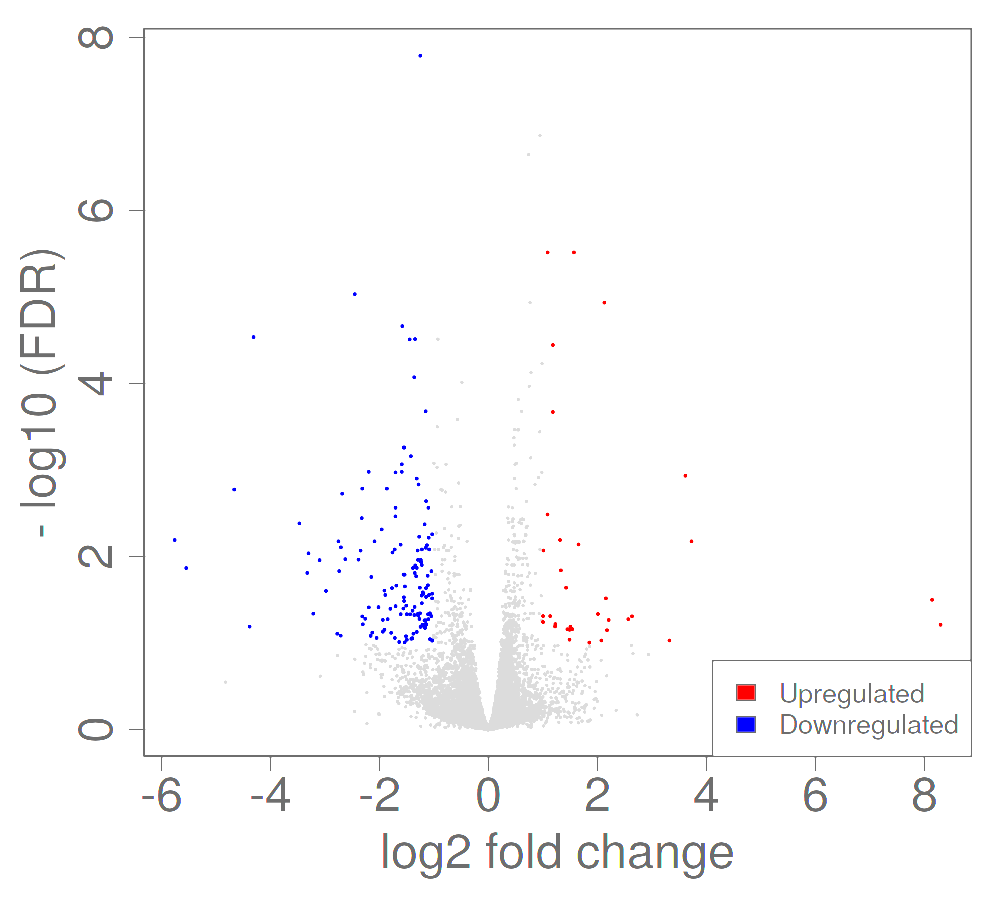

{width=50%}

Using the negative binomial model, we identified 440 genes that were differentially expressed in diseased and treated mice and were also involved in visual system pathways. We investigated genes differentially expressed between the diseased retinas collected at 30 days and retinas genetically rescued for rod death at the same age (but collected at 37 days). This age is again important in recovering bipolar cell rewiring because early genetic rescue recovered the synaptic connections in this animal model (Wang et.al., 2019). After isolating the two most differentially expressed genes involved in the nervous system, \textit{GRIN2B} and \textit{RGS5} were two protein coding genes identified (Steltzer et.al., 2016). \textit{RGS5} (regulators of G protein signaling 5) is a gene that inhibits signal transduction and was found to be up-regulated in treatment groups. \textit{GRIN2B} (Glutamate receptor subunit epsilon-2) is another signal transduction gene and was also up-regulated in treatment groups. Dysfunction in \textit{GRIN2B} has been associated with other nervous system diseases such as epilepsy and autism (Davis et.al., 2017). This gene encodes part of a cell receptor and is identified as important in synaptic plasticity. These two genes are thus potential targets for correcting bipolar cell mis-wiring during the progression of RP.

\textit{GRIN2B} and \textit{RGS5} were found to be regulated across time points in the degeneration time course but not in that of the aging time course. In Fig 2, more genes were observed to be differentially expressed across degeneration groups than in normal aging groups (FDR < 0.10). Of those genes, \textit{GRIN2B} and \textit{RGS5} were differentially regulated across the progression of RP. In the ordered control groups, these \textit{GRIN2B} and \textit{RGS5} were found to be equivalently expressed   \textit{RGS5} is observed to decline in expression with greater degeneration, while \textit{GRIN2B} declines in expression at 90 days of age then increases in expression at 210 days of age. These two genes were not differentially expressed in control animals, thereby indicating that these genes are specifically regulated during degeneration.

